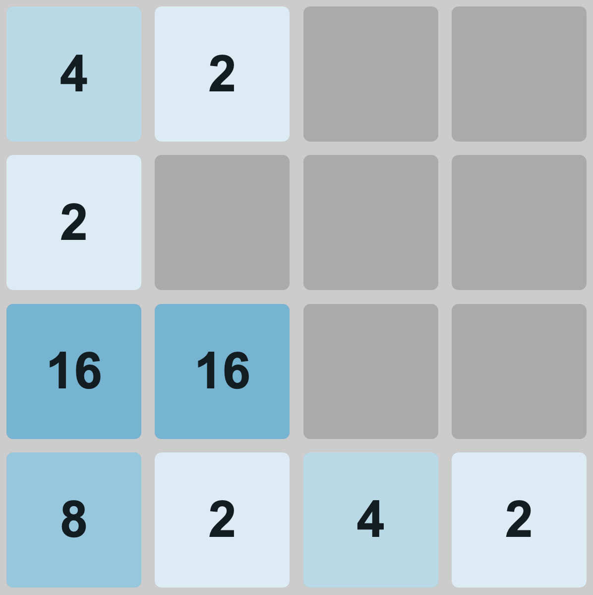

# 2048
2048 is a single-player sliding tile puzzle video game. It is a simple game at first glance, but the amount of logic and planning that goes into creating it is quite advanced.

## How To Play
Combine tiles of the same number in an attempt to create a tile with the value 2048.

Pressing the arrow keys or swiping across the game board will move all tiles in the direction of the key pressed/swipe. After all the tiles are done moving a new tile with the value of 2 or 4 will be created in a random empty cell.

Two tiles with the same number will merge when they collide to create a single tile with double the value.

The game is over when there are no valid ways for you to move the tiles.

